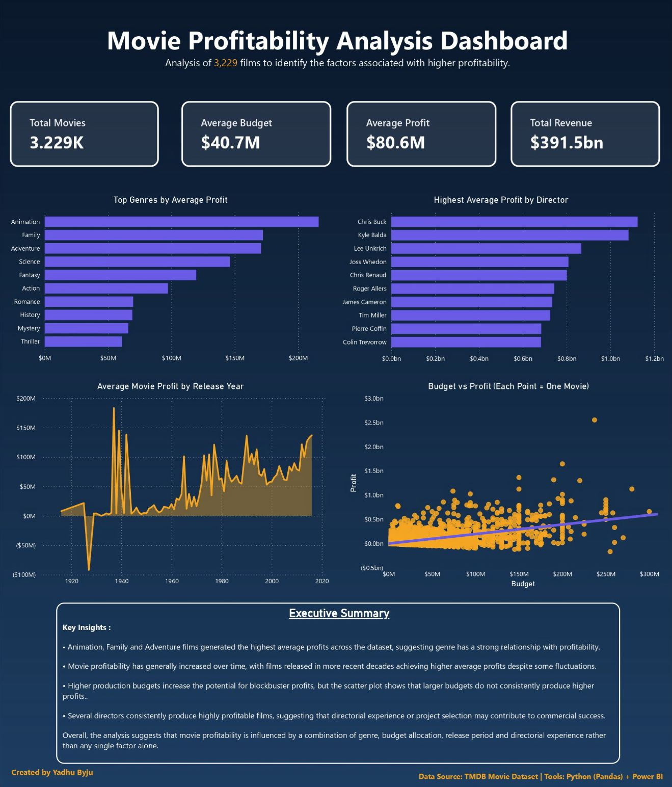

# 🎬 Movie Profitability Analysis | Python & Power BI



## Overview

This project investigates the factors that contribute to movie profitability using the TMDB Movie Dataset.

Using Python (Pandas) for data cleaning and Power BI for interactive visualisation, the project analyses over 3,200 movies to identify how budget, genre, release year and director influence financial performance.

The objective was to answer the business question:

> **What factors make a movie profitable?**

---

## Business Question

Rather than assuming a larger budget guarantees success, this analysis explores how different characteristics combine to influence profitability.

The dashboard allows users to identify:

- Which genres generate the highest average profits
- Which directors consistently produce profitable films
- How profitability has changed over time
- Whether increasing budgets always result in greater profits

---

## Tools Used

- Python (Pandas)
- Google Colab
- Power BI
- Git & GitHub

---

## Dataset

- Source: TMDB Movie Dataset
- Movies analysed: 3,229

---

## Data Cleaning

The dataset was cleaned using Python before being imported into Power BI.

Cleaning included:

- Removing duplicate records
- Removing unnecessary columns
- Handling missing values
- Creating profit calculations
- Standardising genres
- Preparing the dataset for dashboard analysis

---

## Dashboard

The dashboard contains:

- KPI Cards
  - Total Movies
  - Average Budget
  - Average Profit
  - Total Revenue

- Top Genres by Average Profit

- Top Directors by Average Profit

- Average Profit by Release Year

- Budget vs Profit Scatter Plot

- Business Insights Summary

---

## Key Findings

- Genre has a measurable impact on profitability. Animation, Family and Adventure films achieved the highest average profits across the dataset, suggesting that genre has a strong relationship with average profitability.

- Movie profitability has generally increased over time. Despite short-term fluctuations and some early outliers caused by the smaller number of films in older decades, average profits trend upward in more recent years.

- Higher budgets increase the ceiling for profit, but not the probability of success. The scatter plot shows that while blockbuster profits are only achieved with substantial investment, many high-budget films still generate relatively modest profits. Budget alone is therefore a poor predictor of profitability.

- Director selection appears to influence profitability. Several directors consistently delivered significantly higher average profits than others, suggesting that creative leadership and project selection can influence financial performance.

In conclusion, this analysis suggests that movie profitability is driven by multiple interacting factors rather than a single variable. Genre and director both show strong relationships with average profit, while budget increases the opportunity for exceptional returns but also introduces greater financial risk. The findings indicate that successful films result from combining the right creative decisions with appropriate investment, rather than simply spending more money.

---

## Business Recommendations

- Prioritise investment in genres that have consistently demonstrated strong average profitability, particularly Animation, Family and Adventure.

- Avoid assuming that larger production budgets automatically lead to greater profits. Budget decisions should be supported by expected return rather than production scale alone.

- Consider a director's historical financial performance when evaluating future film projects, particularly for high-budget productions.

- Continue monitoring profitability trends over time to identify changing audience preferences and emerging opportunities across different genres.

- Use a combination of genre, budget, release period and directorial experience when assessing investment opportunities, rather than relying on a single factor.

---

## Future Improvements

Potential future enhancements include:

- Incorporating additional variables such as production companies, actors and movie ratings.

- Building predictive machine learning models to estimate movie profitability.

- Publishing the dashboard using Power BI Service for online interactive access.

---

## Repository Structure

```
movie-profitability-analysis/
│
├── dashboard/
│   └── movie-profitability-dashboard.jpeg
│
├── data/
│
├── notebooks/
│
│
└── README.md
```

---

## Author

Created by **Yadhu Byju**